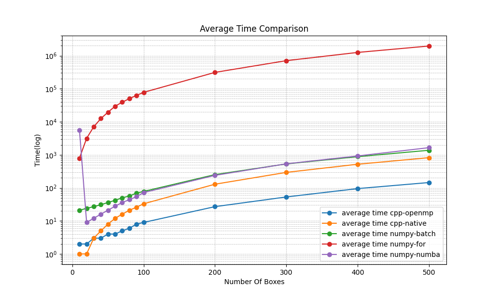
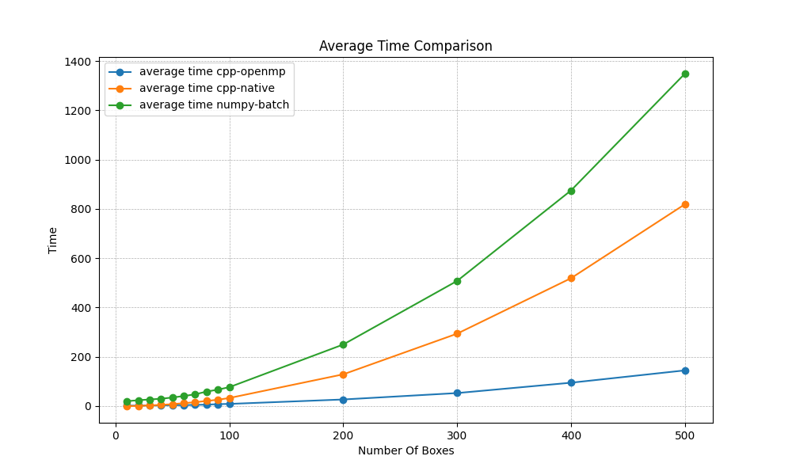

# Intersection-Over-Union
Cython extension for Intersection-Over-Union


## Build
```python
python setup.py build_ext --inplace
```

## Performance
- CPU information of the test platform: **11th Gen Intel(R) Core(TM) i7-11700K @ 3.60GHz**
- Run the following code to test the performance:
```python
python benchmark.py
```


<div align="center">

| number-boxes  |  cpp-openmp  |  cpp-native  |  numpy-batch |  numpy-for   | numpy-numba  |
|---------------|--------------|--------------|--------------|--------------|--------------|
| 10            | 2            | 1            | 21           | 793          | 5608         |
| 20            | 2            | 1            | 24           | 3153         | 9            |
| 30            | 3            | 3            | 27           | 7065         | 12           |
| 40            | 3            | 5            | 31           | 12552        | 16           |
| 50            | 4            | 8            | 36           | 19543        | 21           |
| 60            | 4            | 12           | 42           | 29674        | 28           |
| 70            | 5            | 16           | 50           | 39341        | 36           |
| 80            | 6            | 21           | 57           | 50234        | 44           |
| 90            | 8            | 26           | 69           | 63092        | 54           |
| 100           | 9            | 33           | 78           | 77949        | 72           |
| 200           | 27           | 129          | 252          | 313085       | 239          |
| 300           | 53           | 294          | 530          | 708625       | 535          |
| 400           | 95           | 519          | 880          | 1258429      | 925          |
| 500           | 145          | 819          | 1374         | 1965095      | 1648         |


</div>

- The diagram below shows the performance results of all methods. It is worth noting that, for easier visualization, the time values in the chart are presented in logarithmic scale.

<div align="center">



</div>

- In fact, the implementation based on numpy serves only as a reference to showcase the high performance of the cython-extension, even though the batch-level numpy method has also achieved decent results. However, compared to the native C++ method, the latter can still reduce the runtime by more than half. Furthermore, with the support of OpenMP, the best performance of the extension is significantly enhanced. 
- Therefore, the following diagram only presents the results of the batch-level numpy method, the native C++ method, and further enhancements with OpenMP.


<div align="center">



</div>